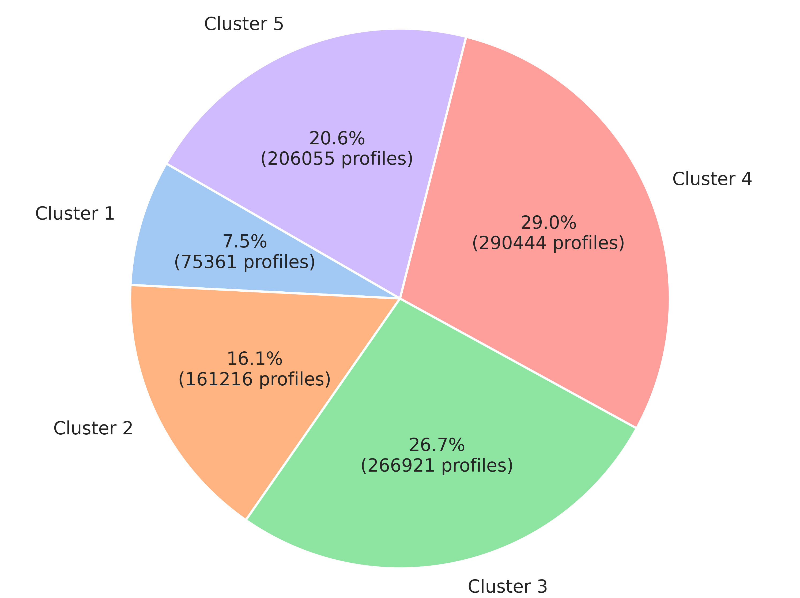

# SynResLoadPattern
[](https://ieeexplore.ieee.org/abstract/document/10973292) [](https://arxiv.org/abs/2504.14300)

Our released dataset *`SynResLoadPattern`*, comprises synthetic residential load patterns that effectively mirror the temporal dependencies and distribution characteristics found in the real-world training data. Providing a vast, diverse, and high-fidelity set of load patterns. This dataset is intended to be a valuable resource for researchers and practitioners for comprehensive analysis, simulation, and exploration in the domain of residential energy consumption.

## Data Description
*`SynResLoadPattern`* is comprised of 1,000,000 synthetic residential load pattern profiles, each of which denotes the normalized hourly electricity consumption within a day, with values ranging from 0 to 1. To distill valuable insights from this dataset and discern underlying consumption patterns, we applied clustering techniques. This approach aids in classifying these profiles into cohesive clusters, illuminating distinct residential energy consumption behaviors. For an in-depth exploration of our clustering methodologies and visualization, please consult [dataset.ipynb](https://github.com/AdamLiang42/SynResLoadPattern/tree/main/dataset.ipynb).


<p align="center">Fig.1: Overview of Sampled Load Patterns and Clustering Centers Across 5 Clusters</p>

The above plot show in Fig. 1 demonstrate the overview of our clustering results, where we clustered the residental load pattern data into 5 clusters, each representing a unique consumption behavior. The thick colored lines in each subplot depict the average consumption pattern of each cluster, while the lighter lines represent individual profiles within the cluster. In the following, we delve deeper into the intricacies of these patterns, discussing the details of load patterns within each cluster:

- **Cluster 1 (Evening and Post-Midnight Dominant Usage):** Patterns in this cluster show elevated consumption after midnight that diminishes through the early morning hours. Throughout the day, consumption remains relatively subdued, but there's a noticeable uptick in the early evening, pointing to increased evening activities.

- **Cluster 2 (Steady Rise to Evening Peak):** Patterns in this cluster depict a reduction in consumption in the hours immediately following midnight, bottoming out in the early morning. As the day unfolds, there's a consistent increase in consumption, reaching a peak in the evening. This underscores a steady yet evening-centric energy consumption behavior for households associated with this cluster.

- **Cluster 3 (Afternoon Surge):** Patterns within this cluster characterize modest energy use post-midnight, initiating an upward trend during the early morning. This surge intensifies by the late morning, peaking in the afternoon. Following this afternoon pinnacle, energy use starts to decline, with a more pronounced drop observed as the day concludes.

- **Cluster 4 (Dual-Peak Behavior):** Patterns in this cluster maintain a steady energy draw post-midnight, experiencing a slight increase in the morning. A more significant consumption uptick is evident by mid-afternoon, peaking in the early evening. This implies dual-peak consumption behavior, resonating with activities during morning and early evening hours. After this evening peak, consumption begins to taper off, descending as midnight nears.

- **Cluster 5 (Noon Dominance):** Patterns in this cluster start with muted energy consumption during the post-midnight phase, then escalate during morning. A salient peak is evident around noon, indicative of noon-oriented activities. Post this noon spike, there's a stepwise decrease in energy use, settling at lower levels during nighttime.

We further provided a breakdown of the distribution of profiles within each cluster using a pie chart shown in Fig.2 below:


<p align="center">Fig.2: Distribution of Profiles Across Clusters</p>

## Data Construction
These residential load pattern profiles were generated using our proposed RLP-GAN framework, trained on a real-world dataset obtained from the Pecan Street database. This original training set contains hourly load recordings of 417 households across the span of an entire year, from Jan. 1, 2017, to Dec. 31, 2017, which were normalized to capture a wide range of daily load patterns and consumption behaviors.

## Dataset Location
- The dataset is located under the following directory: [SynResLoadPattern](https://github.com/AdamLiang42/SynResLoadPattern/tree/main/SynResLoadPattern)

- The data after clustering is located under the following directory: [SynResLoadPattern](https://github.com/AdamLiang42/SynResLoadPattern/tree/main/SynResLoadPatternClustered)

## 📝 Citation & Paper
If you find this dataset or framework useful, please cite our paper:

**X. Liang and H. Wang, "Learning and Generating Diverse Residential Load Patterns Using GAN With Weakly-Supervised Training and Weight Selection," in *IEEE Transactions on Consumer Electronics*, vol. 71, pp. 2837-2848, 2025.**

- **IEEE Xplore:** [View Paper](https://ieeexplore.ieee.org/abstract/document/10973292)
- **ArXiv:** [arXiv:2410.15379](https://arxiv.org/abs/2504.14300)

**BibTeX:**
```bibtex
@ARTICLE{10973292,
  author={Liang, Xinyu and Wang, Hao},
  journal={IEEE Transactions on Consumer Electronics}, 
  title={Learning and Generating Diverse Residential Load Patterns Using GAN With Weakly-Supervised Training and Weight Selection}, 
  year={2025},
  volume={71},
  number={2},
  pages={2837-2848},
  keywords={Load modeling;Data collection;Electricity;Training;Generative adversarial networks;Metadata;Scalability;Adaptation models;Computational modeling;Benchmark testing;Smart meters;residential load data;deep learning;generative adversarial network},
  doi={10.1109/TCE.2025.3563272}}
```


## Acknowledgments:
We would like to acknowledge the sponsorship from FIT Startup Funding of Monash University and the Australian Research Council (ARC) Discovery Early Career Researcher Award (DECRA) under Grant DE230100046.

## License:
This *`SynResLoadPattern`* the Synthetic Residential Load Pattern Dataset is made available under the Open Database License: http://opendatacommons.org/licenses/odbl/1.0/. Any rights in individual contents of the database are licensed under the Database Contents License: http://opendatacommons.org/licenses/dbcl/1.0/.
